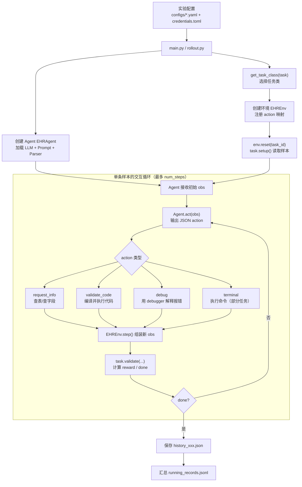
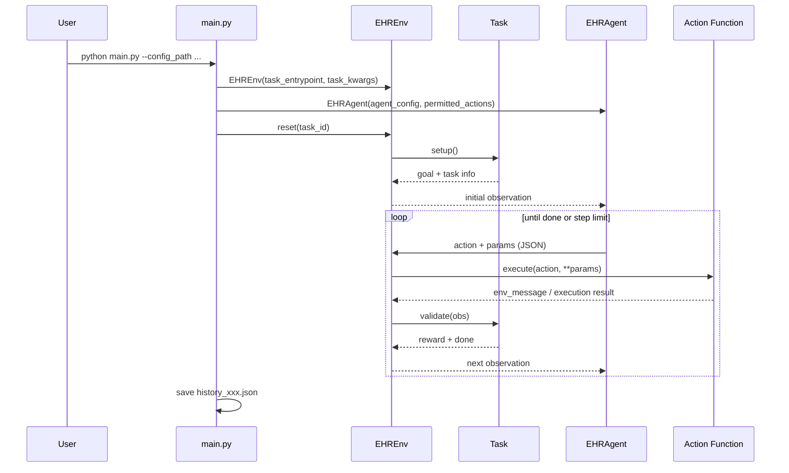

# MedAgentGym 仓库深度解析（从 0 开始）

## 1. 先用一句话说清楚：这个项目在做什么
MedAgentGym 是一个给 LLM Agent 用的“医疗代码推理训练/评测环境”。
它把医疗问答任务转成“写代码 -> 执行代码 -> 根据执行结果继续迭代”的闭环，让模型不只“说答案”，而是“通过可执行程序得到答案”。

对应论文目标是：系统化训练和评估“会写代码做医疗推理”的 Agent。

## 2. 它解决了什么问题
传统医疗 LLM 评测常见问题：
- 只看文本答案，不看推理过程是否可执行。
- 缺少统一环境，不同任务难以复现实验。
- 很难做 trajectory 级别训练（SFT/DPO/RL 都需要轨迹数据）。

MedAgentGym 的解决路径：
- 提供统一的 Gym 风格环境（`EHREnv`），把任务包装成 step-by-step 交互。
- 约束 Agent 通过一组动作（查信息 / 执行代码 / 调试）来推进求解。
- 把每次交互保存为轨迹（history json），方便后续训练。

## 3. 核心动机详细解释：为什么一定要“代码推理 + 可执行验证”

很多人第一次看这个项目会问：医疗问答为什么不直接让模型输出一句答案？  
关键原因是，医疗任务里很多问题本质上是“数据查询 + 规则计算 + 条件判断”，仅靠一段自然语言很难保证可靠。

### 3.1 先看传统做法的问题（只看文本答案）

假设问题是：  
“根据病人笔记和化验值，计算某个医学评分并给出结果。”

传统文本式评测通常这样做：
1. 模型输出一个数字，比如 `17.2`。  
2. 评测脚本只比较这个数字是否接近标准答案。  

表面看没问题，但有 3 个风险：
1. 模型可能“猜对”了结果，但中间推理完全错。  
2. 模型可能把单位用错（mg/dL 和 mmol/L 混了），文本答案看不出来。  
3. 模型一旦错，你不知道错在“读数据”还是“算公式”。

这会导致一个很实际的问题：  
你没法稳定训练它，因为你拿不到“可定位错误的过程数据”。

### 3.2 MedAgentGym 的核心思路

MedAgentGym 强制模型走这条链路：
1. 先决定动作（如 `request_info` 或 `validate_code`）  
2. 写代码  
3. 运行代码拿到真实执行反馈（stdout/stderr）  
4. 基于反馈继续修正  
5. 任务验证器 `validate` 给 reward/done  

这样做的核心价值：
1. 从“答案是否像”变成“过程是否可执行 + 结果是否正确”。  
2. 错误可定位（语法错、路径错、逻辑错、边界条件错）。  
3. 每一步都能落盘成轨迹，直接用于 SFT/DPO/RL。

### 3.3 一个具体例子：只看文本 vs 可执行验证

问题：  
“统计某住院患者过去 24 小时尿量总和，并判断是否少尿。”

#### 传统文本方式
模型直接回答：  
“总尿量 350 ml，属于少尿。”

你不知道它是否：
- 真读了 `outputevents`  
- 真筛了最近 24 小时  
- 真做了求和  
- 用了正确阈值

它可能只是“医学常识猜测”。

#### MedAgentGym 方式
模型必须提交代码，比如：
1. 读取数据表  
2. 过滤病人 ID + 时间窗（24 小时）  
3. 聚合求和  
4. 输出 `answer`

然后 `validate_code` 真运行。  
如果时间筛选写错（比如筛成 48 小时），结果就会偏差，`task.validate` 判错，模型必须继续修。

这时你拿到的是“带错误类型的可执行轨迹”，不是一条黑箱答案。

### 3.4 第二个例子：MedCalcBench 场景

问题：  
“根据病历文本计算某评分（如包含年龄、实验室指标、症状条件）。”

只看文本时，模型可能漏掉一个条件，最终数值看起来还“像对的”。  
在 MedAgentGym 中，模型代码会显式写出每个字段提取和计算步骤。  
一旦字段缺失或分支条件错误，执行结果会暴露问题，你可以明确知道是“抽取错”还是“计算错”。

### 3.5 为什么是统一环境（EHREnv）而不是每个任务各写一套脚本

如果每个任务自己写流程，会出现：
1. 输入输出格式不统一，无法做横向比较。  
2. 轨迹结构不一致，后训练数据难合并。  
3. 工程维护成本高，难扩展新任务。

统一环境带来的好处：
1. 同一 Agent 接口跑多个任务，比较更公平。  
2. 同一动作协议（request/validate/debug），训练数据可复用。  
3. 新任务只需实现 `setup/_get_obs/validate`，扩展成本低。

## 4. 什么场景下会用到这个 repo 的内容（重点）

“你什么时候会实际用 MedAgentGym 这套能力”

### 4.1 你要评估一个医疗 LLM Agent 是否真的会“代码推理”
典型任务：给模型一道 EHR/医学计算题，要求它写代码求解，不接受纯文本拍脑袋答案。  
你会用到：`main.py` + 各任务 `task.validate` + `history_*.json`。  
结果价值：能区分“会说”与“会做”。

### 4.2 你要做多模型横向基准评测
典型任务：比较不同模型（如 GPT 系、开源模型）在统一任务集上的成功率。  
你会用到：统一配置模板（`configs/*`）、统一任务接口（`EHREnv`）、统一输出结构（workdir）。  
结果价值：可复现、可公平对比，而不是每个模型一套私有脚本。

### 4.3 你要生成训练数据（trajectory）用于 SFT/DPO/RL
典型任务：把 Agent 每一步 action/feedback 存下来，做后续训练样本。  
你会用到：`history_*.json`、`rollout.py` 多轨迹采样。  
结果价值：拿到“过程监督”数据，不只是一条最终答案标签。

### 4.4 你要做 inference-time scaling（例如 pass@k）
典型任务：同一题采样 K 条轨迹，再用规则/验证器选最优答案。  
你会用到：`rollout.py` + `data/rollout_indices.json` + 多次 history。  
结果价值：单次回答不稳定时，通过采样和选择提升成功率。

### 4.5 你要验证一个新工具链是否真的提升了医疗任务表现
典型任务：给 Agent 增加新 action（自定义检索器、计算器、数据库连接器）后做 A/B 对比。  
你会用到：`action_set.py`、`function.py`、任务级 `permitted_actions`。  
结果价值：可以用同一 benchmark 验证“改动是否真实有效”。

### 4.6 你在做医疗 AI 系统落地前的风险评估
典型任务：检查模型在结构化数据推理中的稳定性、错误类型和可解释性。  
你会用到：执行报错反馈、调试轨迹、失败样本分析。  
结果价值：提前发现“单位错误、时间窗错误、字段映射错误”等高风险问题。

### 4.7 反例：这些情况不一定需要用这个 repo
1. 你只做通用聊天机器人，不涉及代码执行推理。  
2. 你只需要静态 NLP 分类（如情感分类、NER），没有多步工具调用。  
3. 你不关心过程可执行性，只看一句话答案。

## 5. 仓库核心运行链路（最重要）



### 5.1 入口
- 主评测入口：`main.py`
- 多 rollouts 入口：`rollout.py`

你可以把一次实验理解为：
1. 读配置（模型、数据路径、任务类型、步数等）
2. 根据 `task` 选择任务类
3. 创建环境 `EHREnv`
4. 创建 Agent `EHRAgent`
5. 循环 `num_steps`：
   - Agent 根据 observation 输出 JSON action
   - Env 执行动作（例如 `validate_code`）
   - Task 校验结果，给 reward / done
6. 写出对话与执行轨迹到 `workdir/.../history_xxx.json`

### 5.2 代码上的调用关系
- `main.py` / `rollout.py`
  - `get_task_class(task)` -> 动态映射到 `ehr_gym/env/task/*.py`
  - `run_single_experiment(...)`
    - `env = EHREnv(...)`（`ehr_gym/env/base.py`）
    - `agent = EHRAgent(...)`（`ehr_gym/agent/base.py`）
    - `env.reset(idx)`
    - 循环：`action, params = agent.act(obs)` -> `env.step(action, **params)`
- `EHREnv.step(...)`
  - 从 `action_mapping` 找函数（`ehr_gym/env/action/function.py`）
  - 执行动作后调用 `task.validate(...)` 决定是否完成

## 6. 架构拆解

### 6.1 Environment 层（统一交互协议）
文件：`ehr_gym/env/base.py`

职责：
- 管理任务生命周期（`reset/setup/teardown`）
- 维护交互历史 `env_history`
- 执行动作并返回 observation
- 交给任务特定逻辑做 `validate`

关键点：
- 采用 Gymnasium step 5 元组：`obs, reward, terminated, truncated, info`
- 环境本身不判断“医学正确性”，正确性由 task 子类决定

### 6.1.1 他们是怎么“创建这个环境”的（从代码一步步看）

这部分回答的是：`EHREnv` 不是抽象概念，它在代码里到底怎么被实例化并跑起来。

#### A. 在 `main.py` 里先选任务类
`get_task_class(task)` 会把字符串任务名映射到具体类，例如：
- `biocoder` -> `BiocoderTask`
- `eicu` -> `EicuEHRTask`
- `medagentbench` -> `MedAgentBenchTask`

这一步决定了“环境里装的是什么任务逻辑”。

#### B. 构造任务参数 `task_kwargs`
`run_single_experiment(...)` 里会组装：
- `data_path`
- `debugger_config`
- `mode`（train/test）

这些参数不会立刻加载数据，而是先传给环境保存。

#### C. 真正创建环境对象
在 `main.py` 里执行：

```python
env = EHREnv(task_entrypoint=task_cls, task_kwargs=task_kwargs)
```

此时发生的事（`EHREnv.__init__`）：
1. 保存 `task_entrypoint` 和 `task_kwargs`。  
2. 定义 observation/action space（Gym 风格）。  
3. 构建 action 映射（默认 `BasicActionSet`：`request_info/validate_code/debug/terminal`）。  
4. 初始化一个 debugger LLM（供 `debug` action 用）。  
5. 初始化内部状态（`env_history`、`task=None`、`chat=None`）。

注意：这一步还没加载具体第几条样本，任务数据还没真正读进来。

#### D. `reset(task_id)` 才真正“装载任务样本”
`obs, info = env.reset(idx)` 时才会：
1. 用 `task_entrypoint(task_id=idx, **task_kwargs)` 创建任务实例。  
2. 调 `task.setup()` 读取对应样本（question/answer/context 等）。  
3. 初始化 chat，并把 task goal 写入对话。  
4. 调 `task._get_obs()` 生成第一帧 observation。  
5. 返回给 Agent 作为第一步输入。

所以，`__init__` 是“搭框架”，`reset` 才是“装题目”。

#### E. `step(action, **params)` 才进入交互执行
每一轮：
1. 根据 action 名从 `action_mapping` 找函数（在 `function.py`）。  
2. 执行动作（例如 `validate_code(code)` 真跑 Python）。  
3. 把动作结果转成 observation。  
4. 调 `task.validate(...)` 做任务判分。  
5. 返回 `obs, reward, terminated, truncated, info`。

这就是这个环境被“驱动起来”的核心闭环。

#### F. 一张最小心智图
可以把创建与运行拆成两阶段：
1. 创建阶段：`main.py` 组参数 -> `EHREnv(...)` 搭好运行框架。  
2. 运行阶段：`reset(idx)` 装载样本 -> 多次 `step(...)` 执行动作直到 done。  

这也是它能统一多任务的原因：  
框架层固定（EHREnv），任务层可插拔（不同 task 类）。

### 6.2 Task 层（不同 benchmark 的“题目定义 + 评分器”）
目录：`ehr_gym/env/task/`

每个任务类都实现：
- `setup()`：读任务样本，准备 question/answer/context
- `_get_obs()`：给 Agent 的初始说明（schema、路径、规则）
- `validate(chat_messages, obs)`：检查代码执行输出是否正确

示例：
- `eicu.py` / `ehrcon.py`：EHR 数据理解与查询（允许 `request_info`）
- `medcalcbench.py` / `npowerai.py`：医学计算问题
- `biocoder.py`：函数补全/代码正确性任务
- `medagentbench.py`：FHIR API 交互任务，内置 evaluator

### 6.3 Action 层（Agent 可调用工具）
文件：
- `ehr_gym/env/action/action_set.py`
- `ehr_gym/env/action/function.py`

核心动作：
- `request_info(data_path, info_type, keyterm)`：从 CSV/目录里模糊检索信息
- `validate_code(code)`：编译+落盘+运行 Python，回传 stdout/stderr
- `debug(code, error_msg, debugger, history)`：调用另一个 LLM 产出调试建议
- `terminal(cmd)`：执行 shell 命令

这层相当于 Agent 的“工具调用接口”。

### 6.4 Agent 层（LLM 决策器）
文件：
- `ehr_gym/agent/base.py`
- `ehr_gym/agent/prompt.py`
- `ehr_gym/agent/parser.py`

流程：
- 首轮把 instruction + task_goal + action定义拼成 system/user prompt
- 调用模型（OpenAI/Azure/vLLM）
- 强制解析为 JSON：`{"action":..., "params":...}`
- 失败重试（`n_retry`）

解析器做了严格键校验，避免自由文本污染执行层。

### 6.5 LLM 接入层
文件：`ehr_gym/llm/chat_api.py`

支持：
- OpenAI
- Azure OpenAI
- 本地 vLLM（OpenAI-compatible endpoint）

由 `credentials.toml` + 环境变量驱动密钥配置。

## 7. 数据组织与任务规模

### 7.1 数据结构
- 所有任务在 `data/<task_name>/` 下
- 样本文件通常是 `train_tasks.jsonl` / `test_tasks.jsonl`（或 `valid_tasks.jsonl`）
- 规模汇总在 `data/metadata.json`

### 7.2 任务规模（来自 metadata）
- mimic_iii: train 552 / test 581
- eicu: train 559 / test 610
- treqs: train 897 / test 995
- medcalcbench: train 1005 / test 1046
- medagentbench: train 239 / test 59
- biocoder: train 981 / test 156
- ehrshot: test 15
- ehr_seqsql: train 1000 / test 500
- ehrcon: train 1000 / test 500
- biodsbench: train 50 / test 49
- npowerai: train 865 / test 343
- mimic_extract: test 6

### 7.3 rollout 索引
`rollout.py` 使用 `data/rollout_indices.json` 选择特定索引集来跑多次采样，适合做 pass@k / best@k 分析。

## 8. 运行方式（仓库当前实现）

### 8.1 Docker
- `Dockerfile` 预置 CUDA + Python3.11 + requirements
- `test_docker.sh` 展示了典型 `docker run` 挂载方式

### 8.2 配置驱动
例子：`configs/gpt_4_1_mini/exp-gpt_4_1_mini-biocoder.yaml`
包括：
- Agent 模型参数
- Debugger 模型参数
- Data 路径
- 任务范围（start/end/num_steps）

### 8.3 输出产物
- 每个样本写 `history_xxx.json`
- 汇总日志写到 `work_dir/running_records.jsonl`

## 9. 这个仓库的设计价值（insights）

1. 把“医疗推理”转成“可执行程序推理”
- 这是比纯 CoT 更可验证的范式，便于形成自动评分闭环。

2. 环境与任务解耦清晰
- `EHREnv` 管通用交互，`Task.validate` 管领域评分，易扩展新 benchmark。

3. 天然适合 trajectory 数据生产
- 每一步 action/observation 都可落盘，直接用于 SFT/DPO/RL 数据构建。

4. 多任务统一接口有利于比较模型泛化
- 同一个 agent 框架下切换不同任务，便于横向基准对比。

## 10. 我观察到的工程风险与改进建议（高价值）

### 10.1 文档参数名与代码不一致
- `README` 示例使用 `--config`
- `main.py` / `rollout.py` 实际参数是 `--config_path`

影响：新用户会直接跑失败。
建议：统一成一个参数名并同步 README。

### 10.2 `medcalcbench` 容差判断逻辑可疑
文件：`ehr_gym/env/task/medcalcbench.py`
当前判断：
- `if ans_float >= pred_float * 0.95 or ans_float <= pred_float * 1.05:`

这在大量情况下会“过宽甚至接近恒真”，可能导致误判为正确。
建议改为对称相对误差，例如 `abs(pred-ans)/max(|ans|,eps) <= 0.05`。

### 10.3 action 权限校验不够硬
- `Task` 声明 `permitted_actions`
- 但 `env.step` 只按 `action_mapping` 执行，没有二次校验 action 是否在任务白名单

影响：若模型输出了未授权动作（如 `terminal`），可能仍被执行。
建议：在 `EHRAgent` 返回后或 `EHREnv.step` 前强制白名单检查。

### 10.4 `terminal(cmd)` 存在安全面
- 允许直接 shell 执行，适合研究环境但生产风险较高。
建议：
- 默认关闭 terminal
- 或加命令白名单/沙箱限制。

### 10.5 `request_info` 中异常处理有小 bug
文件：`ehr_gym/env/action/function.py`
- `column_names` 分支 `except` 里引用了未定义 `e`

建议：改成 `except Exception as e:`。

## 11. 如果你要“从 0 到 1”真正用起来，建议路径
1. 先跑最小任务（如 `biocoder` 前 1-5 条）验证链路。
2. 检查 `credentials.toml` 和环境变量是否完整。
3. 看 `workdir/.../history_*.json` 理解 agent 行为模式。
4. 再切到 EHR 类任务（如 `eicu/ehrcon`）观察 `request_info` 的作用。
5. 最后用 `rollout.py` 做多轨迹采样评估。

## 12. 从 0 开始的一个最小 Pipeline 示例（可照着跑）

这里给一个 `biocoder` 的最小例子，目标是只跑 1 条样本，快速打通全链路。

### Step 0: 准备凭证
编辑 `credentials.toml`，至少填好你要用的模型凭证（例如 OpenAI 或 Azure）。

### Step 1: 准备最小配置
新建一个配置文件（例如 `configs/local-demo-biocoder.yaml`）：

```yaml
Agent:
  llm:
    model_type: "OpenAI"
    model_name: "gpt-4.1-mini"
    max_total_tokens: 32768
    max_input_tokens: 8192
    max_new_tokens: 4096
    log_probs: False
    temperature: 0.0
  n_retry: 3
  retry_delay: 5
Data:
  metadata_path: "data/metadata.json"
  data_path: "data/biocoder"
Debugger:
  model_type: "OpenAI"
  model_name: "gpt-4.1-mini"
  max_total_tokens: 32768
  max_input_tokens: 8192
  max_new_tokens: 2048
  log_probs: False
  temperature: 0.0
Env:
  n_retry: 3
task: "biocoder"
credentials_path: "./credentials.toml"
work_dir: "./workdir/demo"
result_dir_tag: "demo-biocoder-k1"
start_idx: 0
end_idx: 1
num_steps: 8
```

### Step 2: 执行命令
```bash
python3 main.py --config_path configs/local-demo-biocoder.yaml
```

### Step 3: 运行时发生了什么（代码级 Pipeline）
1. `main.py` 读取配置并构造 `task=biocoder` 的任务类。  
2. `EHREnv.reset(0)` 加载第 0 条题目，返回初始 observation（包含 question、signature、context）。  
3. `EHRAgent.act(obs)` 让模型输出 JSON action（通常先 `validate_code`）。  
4. `EHREnv.step(action, **params)` 调用对应 action 函数：  
   - `validate_code`：编译并运行代码，收集 stdout/stderr  
   - 如果失败，Agent 可能下一步调用 `debug` 再次修复  
5. `task.validate(...)` 比较预测输出与参考答案，给 reward/done。  
6. done 后把轨迹写入 history 文件。  

### Step 4: 看结果文件
运行后重点看这个目录：

`workdir/demo/biocoder/demo-biocoder-k1/test/`

典型会出现：
- `history_0.json`：完整轨迹（prompt、action、执行反馈、最终 success/failure）

你可以在这个文件里看到完整闭环：  
“模型决定动作 -> 环境执行代码 -> 任务判分 -> 模型继续迭代/结束”。

### 12.1 同一流程的时序图（更像真实运行）



## 13. 结论
这个 repo 的本质不是“医疗 QA 数据集脚本集合”，而是一个“把医疗问题程序化求解”的 Agent 训练与评估基础设施。
它的核心贡献在于：
- 统一环境
- 可执行验证
- 轨迹可沉淀
- 多任务可扩展

对做医疗 Agent 训练来说，这是从“只看最终答案”走向“监督可执行推理过程”的关键一步。
